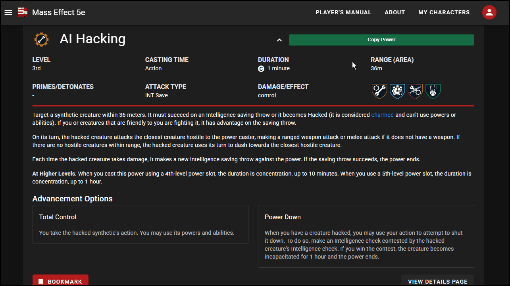

# N7 PowerBridge

**Transfer powers from N7 to Roll20 without rebuilding them field by field.**


[](https://github.com/Speed126/n7-powerbridge/actions/workflows/tests.yml)


Easy to Use: Just open the power on N7 World, copy it, switch to Roll20, and paste. 

The extension parses the useful fields, finds the matching power section, creates a new entry, and fills it in.

## Demo

<p align="center">
  
</p>

The entire workflow is basically:

```text
N7 World
   |
   |  Copy Power
   v
N7 PowerBridge
   |
   |  structured power data
   v
Roll20
   |
   |  Paste N7 Power
   v
new power entry
```

---

## How To Use

### 1. Copy

Open a power on N7 World.

The extension adds a **Copy Power** button directly to the power panel.

You can also right-click and use:

```text
Copy N7 Power
```

The power is parsed into structured data and kept temporarily by the extension.

### 2. Switch

Open the target character sheet in Roll20 and go to its Powers / Spells page.

### 3. Paste

Right-click inside the Roll20 sheet and choose:

```text
Paste N7 Power into Roll20
```

The extension finds the matching cantrip or level section, creates a new repeating power row, and fills the supported fields.

That's it.

---

## What Gets Transferred

N7 PowerBridge currently understands:

| N7 data | Roll20 |
| --- | --- |
| **Name** | Power name |
| **Level** | Cantrip or levels 1–5 |
| **School / type** | Power school |
| **Casting time** | Casting time |
| **Duration** | Duration |
| **Concentration** | Concentration state |
| **Range** | Range |
| **Primes / detonates** | Combo information |
| **Attack type** | Attack field |
| **Damage / effect** | Damage / effect information |
| **Description** | Main power text |
| **Higher levels** | Higher-level scaling text |
| **Advancement options** | Added to the description |

Cantrips are treated as level `0` internally.

---

## Under the Hood

The extension is split around the actual copy/paste flow.

```text
                    N7 power panel
                          |
                          v
                  power-parser.js
             extract + normalize fields
                          |
                          v
                 structured object
                          |
                          v
                    background.js
               chrome.storage.session
                          |
                          v
                 roll20-content.js
                          |
                +---------+---------+
                |                   |
                v                   v
          find level row        map fields
                |                   |
                +---------+---------+
                          |
                          v
                   Roll20 power
```

The source follows those boundaries:

```text
src/
|
+-- power-parser.js
|   turns an N7 power panel into structured power data
|
+-- n7-content.js
|   adds Copy Power controls and handles the N7 side
|
+-- background.js
|   owns the context menus and temporary copied-power state
|
+-- roll20-content.js
    finds the Roll20 destination, creates a row, and fills it
```

### Why `chrome.storage.session`?

My first version of this extension kept the copied power in a normal background variable.

That works right up until Manifest V3 decides the service worker has had enough of existing for a while.

The current version stores the copied power in `chrome.storage.session`, so the copy/paste state isn't tied to one service-worker lifetime.

---

## Roll20 Automation

The Roll20 side does a little more than just find some inputs and start writing into them.

Before adding the new power, it records the repeating entries that already exist in the correct level section.

The process goes:

```text
find correct level
      |
      v
record existing rows
      |
      v
click Add
      |
      v
wait for a NEW row
      |
      v
scope field lookup to that row
      |
      v
fill power
```

Field queries are scoped to the newly-created power instead of repeatedly searching the entire character sheet.

---

## Installation

N7 PowerBridge currently installs as an unpacked Chrome extension.

It requires **Chrome 102 or newer**.

1. Clone or download this repository.
2. Open:

   ```text
   chrome://extensions
   ```

3. Enable **Developer mode**.
4. Click **Load unpacked**.
5. Select the repository folder.

The extension will load its N7 content scripts on N7 World and its Roll20 content script on Roll20.

It is not currently published through the Chrome Web Store.

---

## Troubleshooting

Browser automation has a lot of opportunities to encounter a page that isn't quite where it expected it to be.

The extension has robust console debugging and shows small in-page messages for things like:

```text
No power has been copied
Unsupported power level
Roll20 character sheet isn't ready
Powers / Spells section can't be found
Add button can't be found
New power row never appeared
Expected Roll20 field is missing
```

Most of those are recoverable by opening the right sheet/page or just letting Roll20 finish loading before trying again.

If you fail to solve the issues on your own, feel free to [open a new issue](https://github.com/Speed126/n7-powerbridge/issues/new).

---

## Tests

The DOM parser is isolated from the Chrome extension APIs, which makes it possible to test against HTML fixtures without having to launch the extension itself.

The suite uses Node's built-in test runner with `jsdom`.

Run it with:

```bash
npm test
```

The current fixtures cover:

* a complete power
* cantrips
* levels 1 through 5
* concentration
* prime / detonate combinations
* advancement options
* missing optional fields
* malformed input
* unsupported power levels

Repository checks can also be run with:

```bash
npm run validate
```

That runs `scripts/validate.js`, which syntax-checks the JavaScript files and verifies that local files referenced by `manifest.json` actually exist.

GitHub Actions runs the repository checks and test suite on pushes and pull requests.

---

## Permissions

N7 PowerBridge requests two extension permissions:

```text
contextMenus
storage
```

The content scripts are limited to:

```text
https://n7.world/*
https://*.n7.world/*
https://app.roll20.net/*
```

There is no backend, account system, analytics, or telemetry.

Copied power data lives temporarily in the extension's session storage and is used for the transfer between N7 and Roll20.

---

## License

N7 PowerBridge is released under the [MIT License](LICENSE).

This is an unofficial utility and is not affiliated with or endorsed by N7 World or Roll20.
